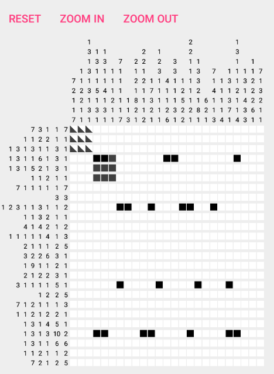

http://www.gchq.gov.uk/press_and_media/news_and_features/Pages/Directors-Christmas-puzzle-2015.aspx

http://www.bbc.co.uk/news/uk-35058761

> Britain's most secretive organisation - GCHQ - has added a cryptic twist to Christmas card season by including a baffling brainteaser.
> This year spy agency director Robert Hannigan is sending out a complex grid-shading puzzle inside his traditional Christmas cards of the nativity scene.
> Successful codebreakers will uncover an image in the grid that leads to a series of tougher challenges.

Hacked this together so I can take the challenge on my phone!

Available on the playstore:

https://play.google.com/store/apps/details?id=com.blundell.shadingpuzzle

APK to give it a go can be found under /releases/

TODO:

 - A winning screen!
